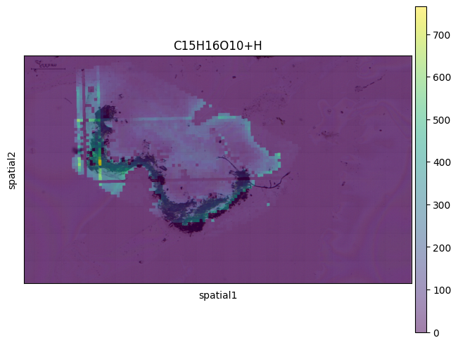

# METASPACE to AnnData

Functions to convert METASPACE datasets to
[AnnData objects](https://anndata.readthedocs.io/en/stable/index.html).

This makes it easy to work with the
[scanpy](https://scanpy.readthedocs.io/en/stable/)
and
[squidpy](https://squidpy.readthedocs.io/en/stable/index.html)
ecosystem with METASPACE data.

## Installation

Clone repository

```
git clone git@git.embl.de:grp-alexandrov/metaspace-to-anndata.git

# Enter directory
cd metaspace-to-anndata
```

Install package in development mode
(in this way updates via `git pull` are applied without re-installation).

```
python -m pip install -e .
```

Import package

```python
import metaspace2anndata
```

# Short tutorial

```python
from metaspace2anndata import dataset_to_anndata, dataset_to_anndata_oi
from metaspace import SMInstance
import scanpy as sc
import squidpy as sq

sm = SMInstance()
ds = sm.dataset(id="2022-08-05_17h28m56s")

# Download data and convert to AnnData object
adata = dataset_to_anndata(ds, fdr=0.1, database=("BraChemDB", "2018-01"))

# Visualization with scanpy
sc.pl.spatial(
    adata,
    color=adata.var.index[0],  # Use first ion for visualization
    img_key=None,
    spot_size=1,
)
```


```python
# Download dataset with optical background image
adata_optical = dataset_to_anndata_oi(ds, fdr=0.1, database=("BraChemDB", "2018-01"))

sq.pl.spatial_scatter(
    adata_optical,
    color=adata_optical.var.index[0],
    shape="square",
    img=True,
    size=3,
    alpha=0.5,
)
```



## Contact

> Tim Daniel Rose (tim.rose@embl.de)
