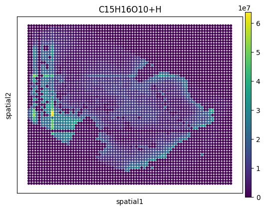
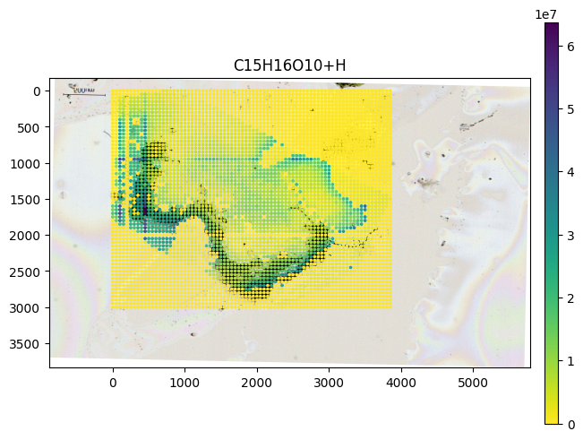

# METASPACE converter

[![Tests][badge-tests]][link-tests]
[![Documentation][badge-docs]][link-docs]
[![PyPI][badge-pypi]][link-pypi]

Python package to download and convert datasets from the [METASPACE](https://metaspace2020.eu/)
knowledge base to common formats for single-cell and spatial omics analysis.
Datasets can be directly downloaded to
[AnnData](https://anndata.readthedocs.io/en/stable/index.html) and
[SpatialData](https://spatialdata.scverse.org/en/latest/) objects.

[AnnData](https://anndata.readthedocs.io/en/stable/index.html) is the underlying data format
of many packages of the [scverse](https://doi.org/10.1038/s41587-023-01733-8) such as
[scanpy](https://scanpy.readthedocs.io/en/stable/) for single-cell data analysis and
[squidpy](https://squidpy.readthedocs.io/en/stable/index.html) for spatial omics analysis.

Another supported format that is part of the [scverse](https://doi.org/10.1038/s41587-023-01733-8)
is [SpatialData](https://spatialdata.scverse.org/en/latest/) for storing, aligning, and processing spatial omics data.
This enables users to easily align and integrate METASPACE datasets
to other spatial omics modalities.

Additionally, the commonly used colocalization analysis for spatial metabolomics can be performed with the package.

If you encounter any bugs or have suggestions for new features, please open an issue in the
[GitHub repository](https://github.com/metaspace2020/metaspace-converter).

## Installation

Our package requires `python >= 3.9`.

You can install the package directly from [PyPI](https://pypi.org/project/metaspace-converter/):

```bash
pip install metaspace-converter
```

## Short tutorial

The full documentation for the package can be found here: [https://metaspace2020.github.io/metaspace-converter/](https://metaspace2020.github.io/metaspace-converter/)

The METASPACE-converter package uses the
[python client](https://github.com/metaspace2020/metaspace/tree/master/metaspace/python-client)
to download datasets from METASPACE.
It serves as a wrapper that downloads and converts datasets directly to
[AnnData](https://anndata.readthedocs.io/en/stable/index.html) and
[SpatialData](https://spatialdata.scverse.org/en/latest/) objects.

If you also need to upload or modify datasets on METASPACE, please check the
[METASPACE python client documentation](https://metaspace2020.readthedocs.io/en/latest/index.html).

### AnnData

Datasets can be downloaded to AnnData objects using the `metaspace_to_anndata` function.
This allows downstream analysis e.g. with [scanpy](https://scanpy.readthedocs.io/en/stable/)
or [squidpy](https://squidpy.readthedocs.io/en/stable/index.html).

#### Scanpy

```python
from metaspace_converter import metaspace_to_anndata
import scanpy as sc

# Download data and convert to an AnnData object
adata = metaspace_to_anndata(
    dataset_id="2022-08-05_17h28m56s",
    fdr=0.1,
    database=("BraChemDB", "2018-01"),
)

# Visualization with ScanPy
sc.pl.spatial(
    adata,
    # Choose the first ion for visualization
    color=adata.var.index[0],
    img_key=None,
    spot_size=1,
)
```



#### Squidpy

Optical images can also be downloaded, if available, and saved in the AnnData object.
Squidpy allows for an easy overlay of ion images and the optical image.

```python
from metaspace_converter import metaspace_to_anndata
import squidpy as sq

# Download dataset with optical background image
adata = metaspace_to_anndata(
    dataset_id="2022-08-05_17h28m56s",
    fdr=0.1,
    database=("BraChemDB", "2018-01"),
    add_optical_image=True,
)

sq.pl.spatial_scatter(
    adata, color=adata.var.index[0], shape="square", img=True, size=15, alpha=0.5
)
```


#### Convert AnnData objects to ion image arrays

If you want to work with the ion images as numpy arrays, the function `anndata_to_image_array` can
convert previously downloaded AnnData objects to numpy arrays.

```python
from metaspace_converter import metaspace_to_anndata, anndata_to_image_array

# Download data
adata2 = metaspace_to_anndata(dataset_id="2023-11-14_21h58m39s", fdr=0.1)

ion_images = anndata_to_image_array(adata2)

# 20 ion images of shape 130x143
print(ion_images.shape)
# > (20, 130, 143)
```

### SpatialData

Download to the [SpatialData](https://spatialdata.scverse.org/en/latest/) format equally easy and
can be done with the `metaspace_to_spatialdata` function.

Here using a reversed colormap which better represents intense values on a bright background.

```python
from metaspace_converter import metaspace_to_spatialdata
import spatialdata_plot  # noqa: Not directly used but extends spatialdata

# Download dataset with optical background image
sdata = metaspace_to_spatialdata(
    dataset_id="2022-08-05_17h28m56s",
    fdr=0.1,
    database=("BraChemDB", "2018-01"),
)

# Workaround: spatialdata-plot currently does not use points transformation
sdata.points["maldi_points"] = sdata.transform_element_to_coordinate_system(
    sdata.points["maldi_points"], "global"
)

(
    sdata.pl.render_images("optical_image")
    .pl.render_points(
        "maldi_points",
        color=sdata.table.var.index[0],
        alpha=1,
        size=2,
        cmap="viridis_r",
    )
    .pl.show(title=sdata.table.var.index[0], coordinate_systems="global")
)
```



## License

Unless specified otherwise in file headers or LICENSE files present in subdirectories, all files are licensed under the [Apache 2.0 license](https://github.com/metaspace2020/metaspace/blob/master/LICENSE).

[badge-docs]: https://img.shields.io/github/actions/workflow/status/metaspace2020/metaspace-converter/docs.yml?label=documentation
[badge-pypi]: https://img.shields.io/pypi/v/metaspace-converter
[badge-tests]: https://img.shields.io/github/actions/workflow/status/metaspace2020/metaspace-converter/tests.yml?branch=master&label=tests
[link-docs]: https://metaspace2020.github.io/metaspace-converter/
[link-pypi]: https://pypi.org/project/metaspace-converter/
[link-tests]: https://github.com/metaspace2020/metaspace-converter/actions/workflows/tests.yml
