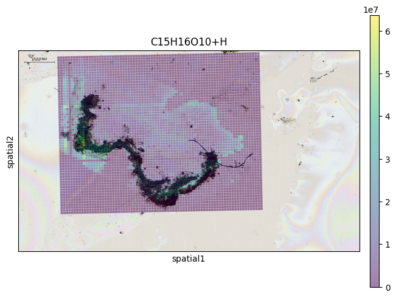

# METASPACE to AnnData

Functions to convert METASPACE datasets to
[AnnData objects](https://anndata.readthedocs.io/en/stable/index.html).

This makes it easy to work with the
[scanpy](https://scanpy.readthedocs.io/en/stable/),
[squidpy](https://squidpy.readthedocs.io/en/stable/index.html)
and
[SpatialData](https://spatialdata.scverse.org/en/latest/)
ecosystem with METASPACE data.

## Installation

Clone repository

```
git clone git@github.com:tdrose/metaspace-converter.git

# Enter directory
cd metaspace-converter
```

Install package in development mode
(in this way updates via `git pull` are applied without re-installation).

```
python -m pip install -e .
```

Import package

```python
import metaspace_converter
```

## Short tutorial

### Plain AnnData with ScanPy

```python
from metaspace_converter import metaspace_to_anndata
import scanpy as sc

# Download data and convert to an AnnData object
adata = metaspace_to_anndata(
    dataset_id="2022-08-05_17h28m56s",
    fdr=0.1,
    database=("BraChemDB", "2018-01"),
)

# Visualization with ScanPy
sc.pl.spatial(
    adata,
    # Choose the first ion for visualization
    color=adata.var.index[0],
    img_key=None,
    spot_size=1,
)
```


### SquidPy

```python
from metaspace_converter import metaspace_to_anndata
import squidpy as sq

# Download dataset with optical background image
adata = metaspace_to_anndata(
    dataset_id="2022-08-05_17h28m56s",
    fdr=0.1,
    database=("BraChemDB", "2018-01"),
    add_optical_image=True,
)

sq.pl.spatial_scatter(
    adata, color=adata.var.index[0], shape="square", img=True, size=15, alpha=0.5
)
```



#### Convert AnnData objects to ion image arrays

```python
from metaspace_converter import metaspace_to_anndata, anndata_to_image_array

# Download data
adata2 = metaspace_to_anndata(dataset_id="2023-11-14_21h58m39s", fdr=0.1)

ion_images = anndata_to_image_array(adata2)

# 6 ion images of shape 61x78
print(ion_images.shape)
# > (6, 61, 78)
```

### SpatialData

Here using a reversed colormap which better represents intense values on bright background.

```python
from metaspace_converter import metaspace_to_spatialdata
import spatialdata_plot  # noqa: Not directly used but extends spatialdata

# Download dataset with optical background image
sdata = metaspace_to_spatialdata(
    dataset_id="2022-08-05_17h28m56s",
    fdr=0.1,
    database=("BraChemDB", "2018-01"),
)

# Workaround: spatialdata-plot currently does not use points transformation
sdata.points["maldi_points"] = sdata.transform_element_to_coordinate_system(
    sdata.points["maldi_points"], "global"
)

(
    sdata.pl.render_images("optical_image")
    .pl.render_points(
        "maldi_points",
        color=sdata.table.var.index[0],
        alpha=1,
        size=2,
        cmap="viridis_r",
    )
    .pl.show(title=sdata.table.var.index[0], coordinate_systems="global")
)
```


## Contact

> Tim Daniel Rose (tim.rose@embl.de)
