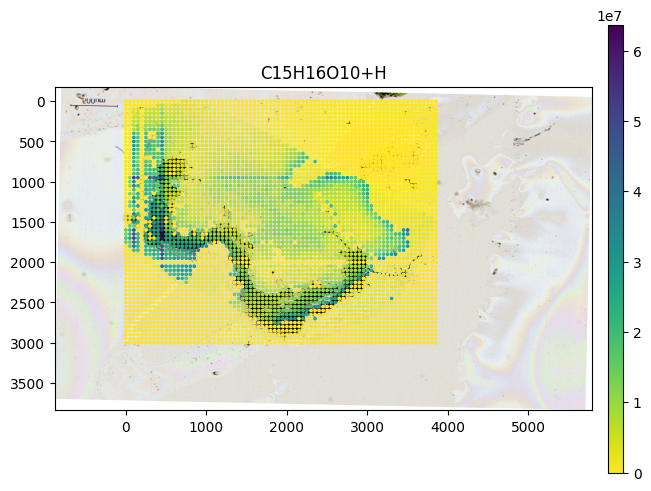

Examples
========

Plain AnnData with ScanPy
-------------------------

.. testcode::

   from metaspace_converter import metaspace_to_anndata
   import scanpy as sc

   # Download data and convert to an AnnData object
   adata = metaspace_to_anndata(
       dataset_id="2022-08-05_17h28m56s",
       fdr=0.1,
       database=("BraChemDB", "2018-01"),
   )

   # Visualization with ScanPy
   sc.pl.spatial(
       adata,
       # Choose first ion for visualization
       color=adata.var.index[0],
       img_key=None,
       spot_size=1,
   )

.. image:: ./_static/img/example_img_sc.png
   :alt: Visualization with ScanPy

SquidPy
-------

.. testcode::

   from metaspace_converter import metaspace_to_anndata
   import squidpy as sq

   # Download dataset with optical background image
   adata = metaspace_to_anndata(
       dataset_id="2022-08-05_17h28m56s",
       fdr=0.1,
       database=("BraChemDB", "2018-01"),
       add_optical_image=True,
   )

   sq.pl.spatial_scatter(
       adata, color=adata.var.index[0], shape="square", img=True, size=15, alpha=0.5
   )

.. image:: ./_static/img/example_img_sq.png
   :alt: Visualization with SquidPy

Convert AnnData objects to ion image arrays
-------------------------------------------

If you want to work with the ion images as numpy arrays, the function `anndata_to_image_array` can
convert previously downloaded AnnData objects to numpy arrays.

.. testcode::

   from metaspace_converter import metaspace_to_anndata, anndata_to_image_array

   # Download data
   adata2 = metaspace_to_anndata(dataset_id="2023-11-14_21h58m39s", fdr=0.1)

   ion_images = anndata_to_image_array(adata2)

   # 20 ion images of shape 130x143
   print(ion_images.shape)

.. testoutput::
   
   (20, 130, 143)

SpatialData
-----------

Here using a reversed colormap which better represents intense values on bright background.

.. testcode::

   from metaspace_converter import metaspace_to_spatialdata
   import spatialdata_plot  # noqa: Not directly used but extends spatialdata

   # Download dataset with optical background image
   sdata = metaspace_to_spatialdata(
       dataset_id="2022-08-05_17h28m56s",
       fdr=0.1,
       database=("BraChemDB", "2018-01"),
   )

   # Workaround: spatialdata-plot currently does not use points transformation
   sdata.points["maldi_points"] = sdata.transform_element_to_coordinate_system(
       sdata.points["maldi_points"], "global"
   )

   (
       sdata.pl.render_images("optical_image")
       .pl.render_points(
           "maldi_points",
           color=sdata.tables["table"].var.index[0],
           alpha=1,
           size=2,
           cmap="viridis_r",
       )
       .pl.show(title=sdata.tables["table"].var.index[0], coordinate_systems="global")
   )

.. testoutput::
   :hide:

   ...

Colocalization Analysis
-----------------------

A popular type of analysis for imaging Mass Spectrometry data or spatial metabolomics 
is colocalization analysis. 
In the `ColocML`_ publication, 
the authors evaluated data processing and colocalization metrics.
Their best method (median filtering, quantile thresholding, and cosine similarity),
can be executed with our package:

.. testcode::

   from metaspace_converter import metaspace_to_anndata, colocalization

   # Download data
   adata = metaspace_to_anndata(dataset_id="2023-11-14_21h58m39s", fdr=0.1)

   # Perform median filtering and quantile thresholding
   # The processed data is saved as a layer `adata.layers["coloc_ml_preprocessing"]`
   # It has the same dimensions as `adata.X`
   colocalization.coloc_ml_preprocessing(adata, layer="colocml_preprocessing")

   # Compute the pairwise colocalization matrix between all ion images
   # As an input, the processed data from `adata.layers["coloc_ml_preprocessing"]` is used
   # The colocalization matrix is saved in `adata.varp["colocalization"]`
   colocalization.colocalization(adata, layer="colocml_preprocessing")

.. _ColocML: https://doi.org/10.1093/bioinformatics/btaa085
